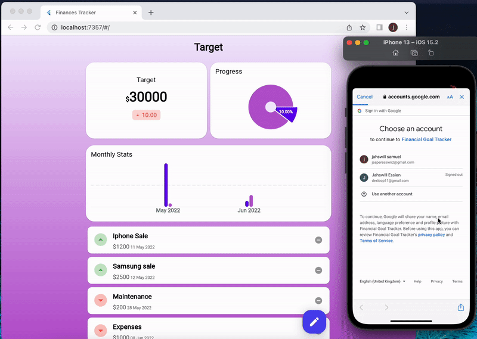

# Financial Goal Tracker

A demo application that that demonstrates how use  Google Sheet on flutter application via Google App Script API. The idea is to track how well a person is doing financially against a target amount.

Here's a demo of the completed application

Additional instructions is needed to run this project. The instructions can be found in an article that's yet to be published (*this link would be included here once published*).

The codebase is organized into three layers 
- **Data:**  Contains model classes, repository implementation, e.t.c. 
- **Domain:** Houses the repository contract.
- **Presentation:** Contains the widgets and data controller files.

The core packages used are:

| Packages| Use cases|
|------ |----- |
|**[google_sign_in](https://pub.dev/packages/google_sign_in)** | Handles authentication and permissions|
|**[dio](https://pub.dev/packages/dio)**|Used in making API requests|
|**[fl_chart](https://pub.dev/packages/fl_chart)**|Used to implement charts in the app|
|**[either_dart](https://pub.dev/packages/either_dart)**|Provides a type safe error handling in dart and flutter|

Click [here](https://gist.github.com/JasperEssien2/9cdcc2173db77c0b4badab2ffbfea3d9#file-completed_code-gs) to get the source code for Google App Script.